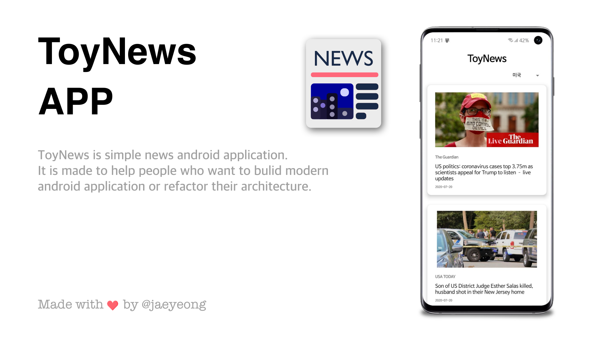

# 김재영 | Junior Software Engineer

### 반갑습니다. 주니어 백엔드 / 안드로이드 개발자 김재영입니다.

### 유려한 UI/UX와 애니메이션을 구현하고 사용하는 것을 좋아합니다.

### 사용자가 기분좋게 사용할 수 있는 서비스를 만들고 싶습니다.

---

# Introduce.

스타트업에서 안드로이드 개발을 맡아 다양한 서비스를 구현했던 경험이 있습니다. 클린 아키텍처를 바탕으로 MVVM, DI, Repository 패턴을 적용하였고 ViewModel, Livedata, Room 등의 AAC Jetpack 라이브러리와 rxJava, retrofit, koin 등 조금 더 나은 구조를 위한 새롭고 다양한 기술들을 활용하였습니다. 

심미적으로 아름다운 UI, 상황에 맞는 매끄러운 애니메이션을 구현하는 것을 좋아합니다. 

좋은 서비스를 만들기 위한, 좋은 사용자 경험을 제공하기 위한 개발자의 역할은 비즈니스 로직의 정확한 구현이나 유지 보수성이 높은 코드를 작성하는 것뿐만은 아닐 것입니다. 이와 더불어 사용자가 기분 좋게 사용할 수 있는 UI/UX 가 뒷받침되어야 하는데, 이는 비단 디자이너 혼자의 역할이 아닌 서비스를 정확히 이해하고 사용자의 입장에서 서비스를 바라볼 수 있는 개발자의 역할이라고 믿습니다.

---

# Work Experience.

## [센디](https://sendy.ai/)

불필요한 과정을 없앤 빠르고 간편한 운송 서비스를 개발하는 스타트업

Back-end Developer

2020.2 - present

Android Developer Intern

2019.12 - 2020.12

## [센디 안드로이드](https://play.google.com/store/apps/details?id=com.venditz.sendy.android)

### Description

센디 안드로이드 앱의 기존 기능을 개선하고 새로운 기능을 개발했습니다.

### What did I do

- 네이버 지도 api와 geocoding api를 활용하여 사용자가 출발, 도착지를 입력 시 해당 경로를 지도에 표시해주는 기능을 개발했습니다.
- 위치 검색 혹은 결제 내역 조회 시 결과 목록에 paging을 적용하여 사용자 경험을 향상시켰습니다.

## [센디 드라이버 안드로이드](https://play.google.com/store/apps/details?id=com.venditz.sendydriver.android)

### Description

센디의 화물차 기사님들이 사용할 센디 드라이버 안드로이드 앱의 신규 기능을 개발했습니다. 

### What did I do

- 사용자의 실시간 위치를 정해진 시간 간격으로 안정적으로 송신하는 기능을구현했습니다.
- 위치 정보를 안드로이드 클라이언트에서 aws kinesis로 전송하는 기능을 구현했습니다.

## [이사모아 안드로이드](https://play.google.com/store/apps/details?id=kr.se.jyc.geo.movingcenter) 개편

### Description

기존 이사모아 안드로이드 앱을 UI부터 내부적으로 디자인 패턴까지 모두 새롭게 개편하는 작업을 맡았습니다.

### What did I do

- 기존 java로 이루어진 코드를 모두 kotlin으로 전환하였습니다.
- 기존 MVP 구조에서 MVVM으로 전환하였고 Livedata, Room, Paging 등 AAC Jetpack을 적극적으로 활용하였습니다.
- 비동기 작업이 필요한 부분은 rxJava를 사용하도록 수정했습니다.
- 1 화면 - 1 액티비티 구조에서 navigation component를 활용한 single activity 구조로 개선했습니다.

---

# Projects.

## ToyNews

2020.05 - 현재

[github](https://github.com/jaeyeong951/toynews)

[playstore](https://play.google.com/store/apps/details?id=com.toy.toynews)

rxJava, MVVM 디자인 패턴, 의존성 주입(Hilt), Navigation Component, ViewBinding 등의 다양한 최신 안드로이드 기술 스택을 적용한 토이프로젝트입니다. 스토어에 릴리즈되어있으며, 개인 공부 / 블로그 포스팅 / 교육 용으로 제작한 프로젝트입니다.

## Alltogether

2020.05 - 2020.09

[github](https://github.com/PNUAllTogether/AllTogetherAndroid)

특수 교육이 필요한 아동과 이들을 지원하는 봉사자, 특수 교사의 매칭을 위한 플랫폼입니다.
클라이언트 안드로이드 애플리케이션, 백엔드는 스프링부트 프레임워크를 이용해 제작하였습니다.
특수교육과 학생들과 협업했던 프로젝트입니다. 특수교육은 제가 전혀 모르는 분야였지만, 그들의 이야기를 듣고 현재의 문제점을 파악하여 이에 적합한 서비스를 개발했던 뜻 깊은 프로젝트였습니다.

## BookReviewer

2020.03 - 2020.05

[github](https://github.com/PNU-2020-team4/Book-Review-Platform-Front-End)

[playstore](https://play.google.com/store/apps/details?id=com.team4.bookreview)

국내 다양한 온라인 서점 사이트들의 도서 리뷰를 한 곳에 모아 간단히 보여주는 애플리케이션입니다.
프론트는 안드로이드 네이티브 앱, 백엔드는 스프링 부트로 제작하였습니다.
하나의 도서에 대해 각종 서점 사이트들의 리뷰 조회는 물론 자신의 리뷰 등록, 가격 비교, 실시간 인기 서적 조회 등 읽고싶은 책을 찾고 싶은 사람들을 위한 기능들을 모두 담았습니다.

도서 리뷰 공유 플랫폼으로서의 기능에 충실하면서 사용자가 기분좋게 사용할 수 있는, 심미적으로 아름다운 UI/UX를 만들기 위해 노력했습니다.

---

# Other Experience.

## Blog

2020.01 - 현재

[https://medium.com/@jaeyeong951](https://medium.com/@jaeyeong951)

미디엄이라는 블로깅 플랫폼에 제가 안드로이드에 대해 공부하면서 인상 깊었던 것, 남들과 공유하고 싶은 정보들을 자유롭게 포스팅하고 있습니다.

## 산호세 주립대 SW 해외교육 프로그램

2020.07 - 2020.08

미국 산호세 주립대학교에서 제공하는 소프트웨어 해외교육 프로그램에 참가했습니다. 
산호세 주립대의 특강은 물론, 실리콘밸리의 유수 IT 대기업들을 방문하고 그 곳에서 근무중인 현업 개발자들을 만나 그들의 이야기를 직접 들어볼 수 있었던 값진 경험이었습니다.

---

# Skills.

## Android

- Kotlin
- AAC Jetpack
- Retrofit
- Material Design Component

- Java
- rxJava
- View Binding

- MVVM
- DI(Koin, Hilt)
- Room

### Etc

- Jira

- Git/Github

- Agile

---

# Education.

## 부산대학교

정보컴퓨터공학과

2015.03 - 2021.02

정보컴퓨터공학과에서 4년간 수학하며 알고리즘, 자료구조, 네트워크 등 컴퓨터 사이언스 전반에 대한 지식을 습득하였습니다. 개인적으로 운영체제, 소프트웨어공학 과목을 가장 흥미롭게 수강하였습니다.

---

# Contact.

### Email : jaeyeong951@gmail.com

### Phone : 010-9816-0079

### Blog : [https://medium.com/@jaeyeong951](https://medium.com/@jaeyeong951)