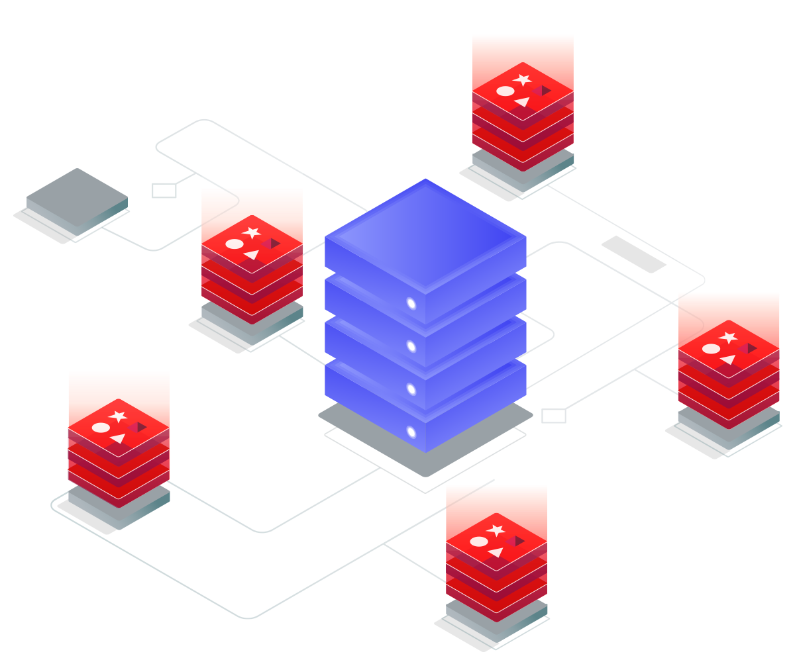
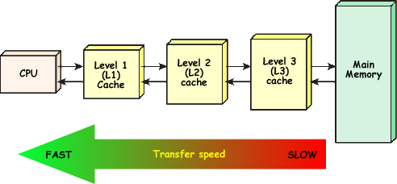

## Cache ?

- 데이터(혹은 어떤 요청에 대한 결과)를 미리 저장해두었다가 나중에 다시 요청이 들어오면 빠르게 서비스 해주기위한 저장소
- 원본 데이터(disk)에 접근하는데 걸리는 시간이 캐시의 접근 시간보다 오래 걸리는 경우나 값을 다시 계산하는데 걸리는 시간을 단축시키고 싶은 경우 사용

## 파레토의 법칙(Pareto principle, law of the vital few)

- 전체 결과의 80%가 전체 원인의 20%에서 일어나는 현상
- 이 법칙을 서버에 적용하면,
- 전체 요청의 80%는 20%의 사용자로부터 나온다는 의미로 볼 수 있고
- 혹은 **전체 부하의 80%는 특정 20%의 요청에서 나온다**는 의미이기도 하다.
- 이미 요청한 데이터를 다시 요청하는 경우가 많다는 의미이다.
- 그러니 캐싱을 활용하여 read 성능을 향상시켜보자!

### 캐시를 사용하기 적절한 데이터인지 판단하는 기준

- 데이터가 변경에 민감한지?
- 데이터의 연산에 드는 비용이 비싼지?
- 데이터의 변경이 전파가 되는지?
- 요약하자면, "**잘 바뀌지 않으면서 접근할 일이 많은 데이터**, 변경되더라도 다른 서비스에 큰 영향을 미치지 않는 데이터" 가 캐시에 사용하기 적절하다.

### 2가지 Caching 전략

- Look aside Cache
   1. Cache 에 원하는 Data 가 있는지 유무 확인
   2. Data 가 존재한다면 해당 Data 를 바로 사용
   3. Data 가 없다면 실제 DB 에 접근
   4. 해당 Data 를 캐시에 저장
   - Cache 를 사용한다고 하면 대부분 이 개념으로 사용한다고 보면 된다
- Write Back
   1. 쓰기 요청시 해당 Data 를 DB가 아닌 Cache 에 먼저 저장
   2. 일정량 혹은 일정 시간 이상 Cache 에 Data 를 모은 후 실제 DB에 한꺼번에 저장
   3. Cache 에 쌓였던 Data 삭제
   - 이 전략은 Cache 를 조금 다른 용도로 사용하는 것 → 쓰기 Cache 로 사용
   - DB 에 쓰기작업의 횟수를 최소화하여 퍼포먼스의 향상을 가져오겠다는 뜻
   - 극단적으로 heavy 한 write 가 있을 경우 사용
   - 하지만 Cache 에 저장되는 만큼 **데이터의 유실 가능성**이 있지 않을까?

## Redis ?

- **key-value 구조의 비정형 데이터(NoSQL)를 저장하고 관리하기 위한** Open Source **기반의 DBMS**(BSD 3)
- **In-Memory** 데이터 저장소
   - **disk가 아닌 메모리를 데이터 저장소로 활용**
- 지원하는 자료구조
   - String, Set, Sorted-Set, Hashes, List
   - Hyperloglog, bitmap, geospatial index
   - Stream
   - **다양한 자료구조의 지원은 레디스의 큰 장점 중 하나**
- 단 한명의 Committer → Redis 의 코드를 고칠 수 있는 사람은 단 한명

## Redis Collections

- String → key : value 형태의 자료구조
- List
- Set → 중복된 값 X
- Sorted Set → 순서를 보장하는 Set
- Hash

### String

- 기본 사용법
   - Set [key] [value]
   - Get [key]
   - mset, mget 한번에 여러개 처리
- `Set Token:1234567 abcdefg`
- `Get Token:1234567`
- Key 를 어떻게 잡을건지 고민해야한다.
- 보통 위의 예시처럼 key를 Token:~ 형식으로 prefix 를 많이 붙인다.
- 이를 통해 분산을 어떻게 할지 정할 수 있다.

### List

- Lpush [key] [A]
- Rpush [key] [B]
- Lpop, Rpop [key]
- BLpop → 데이터가 push 되기까지 대기
- JobQueue 의 경우 List 를 많이 쓴다.

### Set

- SADD [key] [value]
   - value 가 이미 해당 Key 에 있으면 추가되지 않는다.
- SMEMBERS
   - 해당 key의 모든 value를 돌려줌
- SISMEMBER
   - value가 존재하면 1, 아니면 0

### Sorted Set

- ZADD [key] [score] [member]
   - member 가 key, score 가 value 의 역할을 한다고 생각하면 된다.
   - score 값을 기준으로 각 원소들이 순서를 가지게 된다.
   - Set 이기 때문에 member 는 unique 하고, member 값을 통해 O(1) 로 원하는 원소에 바로 접근할 수 있다.
   - **Sorted Set 의 score는 실수형(double)임에 유의하자.**
- ZSCORE [key] [member]
   - 해당 member 의 score 조회
- ZRANK [key] [member]
   - 해당 member 의 rank(몇 번째인지) 조회
- ZRANGE [key] [start] [stop]
   - 정렬된 원소 중 내가 원하는 범위만큼만 출력한다.
   - 첫번째 원소를 0이라 했을 때의 상대적인 위치값이고, 양수/음수 모두 가능하다.
- ZRANGE [key] 0 -1
   - 해당 key의 모든 member 출력
   - 0 0 → 가장 낮은 멤버, 1 1 → 가장 높은 멤버
   - 순서를 반대로 하고싶은 경우 ZREVRANGE 사용
- 만약 member의 score도 함께 출력하고 싶다면, `WITHSCORES` 옵션을 추가하면 된다.

### Hash

- Key 밑에 또다른 Key-Value set이 존재하는 자료구조
- Key 하나에 여러개의 field와 value로 구성되는 것
- RDB의 table과 비슷하다.
- key는 table의 PK, field는 column, value는 value로 보면 된다.
- 해당 key에 어떤 Collection 자체를 저장한다고 생각해도 된다.
- HMSET [key] [subKey1] [value] [subKey2] …
- HGETALL [key]
   - 해당 key의 모든 subkey 와 value 를 가져옴
- HGET [key] [subKey]

### Redis에서 Collection 사용 시 주의사항

- 하나의 컬렉션에 너무 많은 아이템을 담지 말자.
   - 10000개 이하로 유지하는게 좋다.
- Expire는 Collection의 item 개별로 걸리지 않고 전체 Collection에 대해서 걸린다.
   - 10000개의 아이템을 가진 컬렉션에 expire가 걸려있다면 해당 시간후에 모든 아이템이 삭제됨

## Redis 운영 시 주의사항

### 메모리 관리

- **Redis가 메모리를 많이 사용하게되면 심각한 문제가 발생**할 수 있다.
- Redis는 In-memory Data Store.
- 물리적 메모리 그 이상을 사용하게 되면 문제가 발생
   - Swap이 한번이라도 발생한 메모리 페이지는 계속 Swap이 일어난다.
   - 심각한 성능 저하가 발생
- Maxmemory를 설정하더라도 이보다 더 사용할 가능성이 크다.
   - Maxmemory → 일정 메모리이상은 사용하지 말라고 설정하는 것
   - 해당 메모리보다 더 써야할 것 같은 상황이 오면
   - 이미 존재하는 키중 몇개를 지우거나, expire 목록중에서 몇개를 지워서 메모리를 확보
   - **Redis는 자기 자신이 정확히 얼마만큼의 메모리를 사용하는지 모른다.**
- Redis는 메모리 파편화가 발생할 가능성이 있다. 4 버전 이상부터는 파편화를 줄이도록 jemalloc에 힌트를 주는 기능이 들어갔으나, 버전에 따라 다르게 동작할 가능성이 있다.
- 3 버전대의 경우 실제 used memory는 2GB로 보고 되지만, 11GB의 RSS를 사용하는 경우가 발생
- **RSS 값을 항상 모니터링 해야한다.**
- 메모리가 부족할 때는?
   - 좀 더 메모리가 많은 장비로 migration 하자.
   - 하지만 현재 장비의 메모리가 빡빡한 경우에는 migration 중에 문제가 발생할 수도 있다.
- 다음 Collection들은 내부 구현때문에 메모리를 많이 차지한다.
   - Hash → Hash Table을 하나 더 사용
   - Sorted Set → Skiplist와 Hash Table 둘 다 사용
   - Set → Hash Table
   - Ziplist 를 이용하도록 설정해보자.

### Ziplist 구조

- In-memory 특성 상, 적은 개수라면 굳이 인덱스 탐색을 하지않고 선형 탐색을 하더라도 속도차이가 얼마 나지 않는다.
- 그래서 List, Hash, Sorted Set 등의 구현을 Ziplist로 대체할 수 있는 설정이 존재한다.
- 메모리 사용량이 20~30% 이상 차이가 난다.
- 개수가 많아지면 알아서 기존의 구현으로 돌아간다. → 속도를 유지하는 대신 메모리 사용량이 늘어날 것

### O(N) 관련 명령어에 대한 주의

- Redis는 Single Threaded.
   - **동시에 처리할 수 있는 명령의 개수가 하나라는 뜻**
   - 긴 시간을 요하는 명령을 실행한다면 **뒤의 모든 명령은 대기**하게 됨
- 대표적인 O(N) 명령등
   - Keys → 모든 key를 순회
   - FLUSHALL, FLUSHDB
   - DELETE Collections → 적은 개수의 컬렉션이면 상관없지만 1만개가 넘어가면 1~2초 걸린다.
   - GET ALL Collections → DELETE 와 마찬가지
   - 위의 명령들은 되도록이면 피하자.
- 실수 사례
   - Key가 백만개 이상인데 확인을 위해 Keys 명령을 사용하는 경우
   - 아이템이 몇만개 들어있는 Hash, Sorted Set, Set 에서 모든 데이터를 가져오는 경우
- Key를 어떻게 대체하면 되나?
   - scan 명령으로 하나의 큰 명령을 여러개의 작은 명령으로 쪼갤 수 있다.
   - 쪼개진 작은 명령 사이에 몇만개의 get, set 명령이 수행될 수 있다.
- Collection의 모든 아이템을 가져와야만 한다면?
   - Collection의 일부만 가져오면 안되는건지 고민해보자.
   - 큰 Collection을 작은 여러개의 Collection들로 나누어 저장하자.
   - 하나당 몇천개 안쪽으로 유지

## Redis 정리

- Redis 는 기본적으로 매우 강력하고 좋은 툴이다.
- 하지만 메모리를 빡빡하게 사용할 경우 안좋은 툴로 변한다.
- 메모리를 70-80% 이상 사용중이라면 장비 증설을 고려하자.
- 마이그레이션도 주의해서 진행해야 한다.

### Redis as Cache

- 특별한 경우가 아닌 이상 큰 문제가 발생할 여지는 적다.
- DB가 못버틸 정도의 부하가 아닌 이상 문제는 잘 없다. → Redis에 문제가 있다면 DB 부하를 살펴보자.
- Consistent Hashing 도 실제로 부하를 아주 균등하게 나누지는 않는다. → Adaptive Consistent Hashing 을 이용해 보자.

### Redis as Persistent Store

- 반드시 Primary/Secondary 구조로 구성하자.
   - 데이터 유실을 최소화 해야한다.
   - Persistent Store로 사용하는 경우 migration 이슈가 반드시 발생할텐데, 이 때 Primary/Secondary 구조가 아니면 힘들다.
   - 정기적으로 Secondary로 백업이 필요하다.
- 메모리를 절대 빡빡하게 사용하면 안된다.
   - Persistent Store 니까 데이터 유실을 더욱더 최소화 해야한다.

----

## Reference

[[우아한테크세미나] 191121 우아한레디스 by 강대명님](https://www.youtube.com/watch?v=mPB2CZiAkKM)

[[Redis] 캐시(Cache)와 Redis](https://sabarada.tistory.com/103)

[레디스(Redis)의 다양한 활용 사례](https://happyer16.tistory.com/entry/%EB%A0%88%EB%94%94%EC%8A%A4Redis%EC%9D%98-%EB%8B%A4%EC%96%91%ED%95%9C-%ED%99%9C%EC%9A%A9-%EC%82%AC%EB%A1%80)

[캐시의 모든 것 내용 정리](https://velog.io/@wnwl1216/%EC%BA%90%EC%8B%9C%EC%9D%98-%EB%AA%A8%EB%93%A0-%EA%B2%83-%EC%A0%95%EB%A6%AC)

[인메모리 데이터 저장소 Redis, 왜 사용할까? #Redis 파헤치기](https://zangzangs.tistory.com/72)

[(Redis) Redis란? 우아한 Redis 발표영상 후기](https://lion-king.tistory.com/entry/Redis-what-is)

